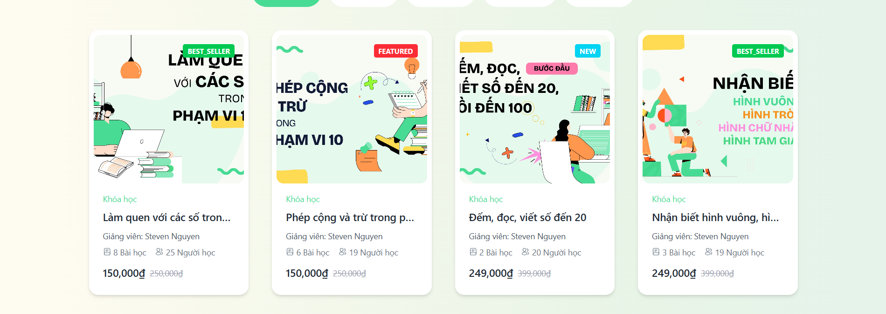
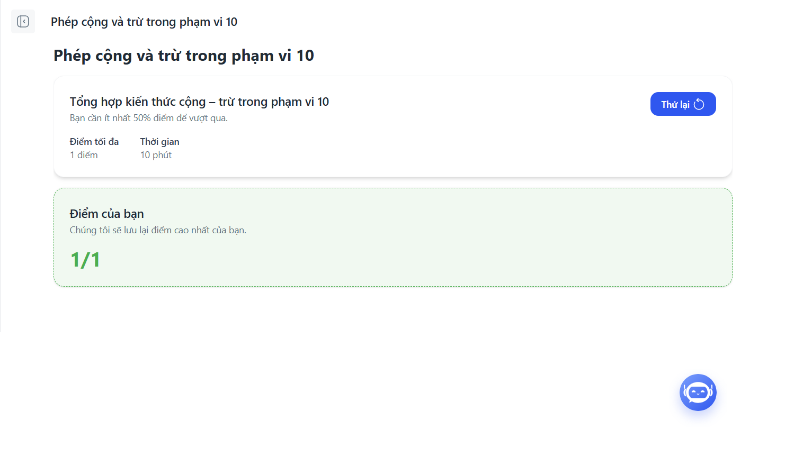
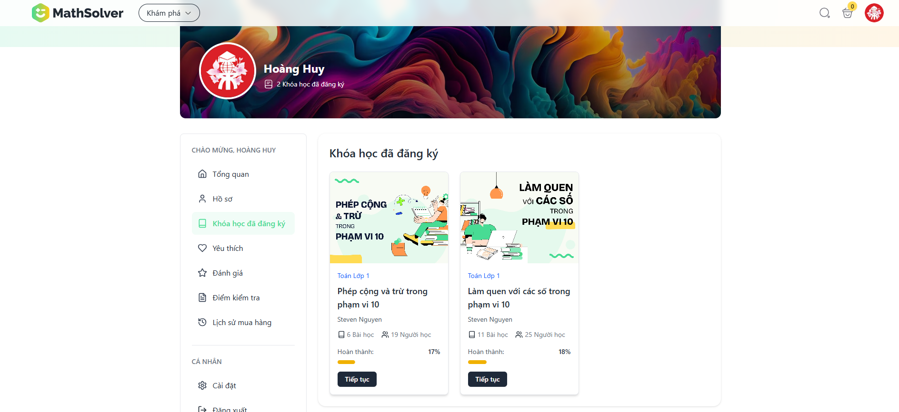
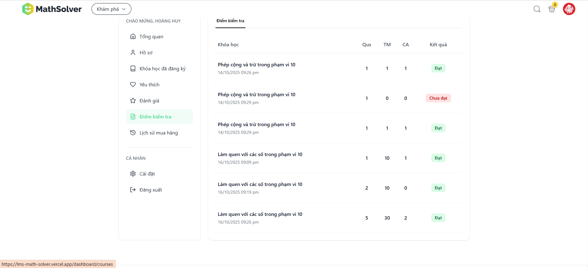
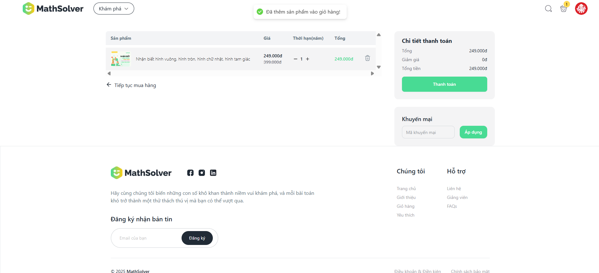
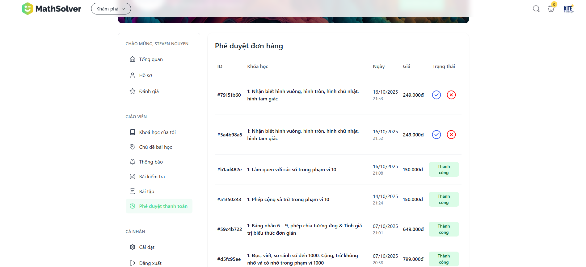

# 🧮 **Math Solver – Chinh Phục Mọi Thử Thách Toán Học!**

## 📌 **Giới thiệu tổng quan**

Math Solver là nền tảng giáo dục trực tuyến chuyên biệt dành cho học sinh cấp Tiểu học (từ lớp 1 đến lớp 5), tập trung vào việc **biến nỗi sợ toán thành niềm yêu thích** thông qua các khóa học chất lượng cao, video hướng dẫn sinh động và bài tập thực hành tương tác.

> 🎯 "Chinh Phục Mọi Thử Thách Toán Học! – Từ cơ bản đến nâng cao!"

## [LINK-WEBSITE](https://lms-math-solver.vercel.app/)

## [LINK-DEMO](https://drive.google.com/drive/folders/1XCNT-RXTh0DgZQeIWGZwOYBjcrVczGmx?usp=sharing)

---

## 🎯 **Mục tiêu chính**

- **Biến nỗi sợ toán thành niềm yêu thích** cho học sinh tiểu học
- Cung cấp **khóa học chất lượng cao** từ cơ bản đến nâng cao
- Xây dựng **lộ trình học tập cá nhân hóa** phù hợp với từng độ tuổi
- Tạo **không gian học tập truyền cảm hứng** và thân thiện với trẻ em
- Hỗ trợ **phụ huynh** trong việc theo dõi tiến trình học tập của con

---

## 🧩 **Tính năng chính**

### ✅ 1. **Hệ thống đăng ký & xác thực**

- Đăng ký tài khoản với email/mật khẩu
- Xác thực email qua mã OTP
- Quên mật khẩu và đặt lại mật khẩu mới
- Giao diện thân thiện cho cả phụ huynh và học sinh nhỏ tuổi

---

### 📚 2. **Hệ thống khóa học & bài học**

- **Danh mục khóa học**: Phân loại theo lớp học (1-5) và độ khó
- **Chi tiết khóa học**: Mô tả chi tiết, yêu cầu và kết quả học tập mong đợi
- **Nội dung đa dạng**: Video hướng dẫn sinh động, bài tập thực hành, trò chơi tương tác
- **Lộ trình cá nhân hóa**: AI đánh giá năng lực và đề xuất bài học phù hợp
- **Theo dõi tiến trình**: Hiển thị % hoàn thành và điểm số chi tiết

---

### 🎮 3. **Hệ thống bài tập & trò chơi tương tác**

- **Bài tập cơ bản**: Từ những phép tính đơn giản đến các dạng bài phức tạp
- **Thử thách nâng cao**: Các bài toán khó giúp phát triển tư duy logic
- **Hệ thống chấm điểm**: Đánh giá và phản hồi chi tiết
- **Gợi ý học tập**: Hướng dẫn giải bài khi học sinh gặp khó khăn

---

### 👨‍🎓 4. **Dashboard học sinh**

- **Tổng quan học tập**: Thống kê khóa học đã đăng ký, đang học, đã hoàn thành
- **Khóa học của tôi**: Danh sách khóa học với tiến trình học tập chi tiết
- **Hồ sơ cá nhân**: Chỉnh sửa thông tin, avatar, cài đặt cá nhân
- **Thành tích học tập**: Theo dõi điểm số, huy hiệu, lịch sử học tập

---

### 🏆 5. **Hệ thống thành tích & động lực**

- **Lịch sử học tập**: Theo dõi chi tiết quá trình phát triển

---

### 🛒 6. **Hệ thống thanh toán & mua khóa học**

- **Giỏ hàng thông minh**: Thêm nhiều khóa học và quản lý đơn hàng
- **Thanh toán an toàn**: Hỗ trợ nhiều phương thức thanh toán
- **Ưu đãi hấp dẫn**: Các chương trình khuyến mãi thường xuyên
- **Mua một lần, học trọn đời**: Mô hình giáo dục số hiệu quả
- **Lịch sử mua hàng**: Theo dõi các giao dịch đã thực hiện

---

### 🔧 7. **Hệ thống quản trị (Admin)**

- **Dashboard quản trị**: Thống kê tổng quan về người dùng và khóa học
- **Quản lý khóa học**: Tạo, chỉnh sửa, xóa khóa học và bài học
- **Quản lý nội dung**: Upload video, tài liệu, bài tập
- **Quản lý người dùng**: Xem danh sách học sinh và thống kê học tập
- **Quản lý thanh toán**: Theo dõi các giao dịch và doanh thu

---

## ⚙️ **Công nghệ sử dụng**

| Hạng mục       | Công nghệ sử dụng     |
|----------------|------------------------|
| Frontend       | Next.js 14, React 18, TypeScript |
| UI Framework   | Tailwind CSS, Ant Design, shadcn/ui |
| State Management | Redux Toolkit, React Query |
| Backend        | NestJS, Node.js |
| Database       | MongoDB |
| Authentication | JWT, NextAuth.js |
| File Storage   | Cloudinary |
| Payment        | PayPal, Stripe |

---

## 🚀 **Tính năng nổi bật**

- **Giao diện tươi sáng**: Thiết kế thân thiện và truyền cảm hứng cho trẻ em
- **Học tập cá nhân hóa**: AI đánh giá và đề xuất lộ trình phù hợp
- **Nội dung đa dạng**: Video, bài tập, trò chơi tương tác
- **Hệ thống bảo mật**: Đảm bảo an toàn thông tin người dùng
- **Responsive Design**: Hoạt động mượt mà trên mọi thiết bị
- **SEO tối ưu**: Dễ dàng tìm kiếm và chia sẻ trên mạng xã hội

---

## 📱 **Đối tượng sử dụng**

- **Học sinh tiểu học**: Từ lớp 1 đến lớp 5 muốn học toán hiệu quả
- **Phụ huynh**: Theo dõi và hỗ trợ con em trong việc học toán
- **Giáo viên**: Sử dụng làm công cụ hỗ trợ giảng dạy và ôn tập
- **Trường học**: Tích hợp vào chương trình giáo dục chính thức

---

## 🎨 **Giao diện & Trải nghiệm**

Math Solver được thiết kế với giao diện tươi sáng và năng động, tạo cảm giác hứng thú cho học sinh khi học tập. Banner quảng cáo với các ưu đãi hấp dẫn như "Nhanh tay nhận ưu đãi đến 50%" giúp thu hút người dùng và khuyến khích đăng ký sớm.

---

## 🔮 **Tương lai phát triển**

- **Mở rộng cấp học**: Phát triển thêm cho học sinh THCS và THPT
- **Ứng dụng di động**: Ra mắt app mobile để học mọi lúc mọi nơi
- **Trò chơi toán học**: Phát triển thêm các game tương tác
- **AI Tutor**: Trợ lý học tập thông minh hỗ trợ 24/7
- **Cộng đồng học tập**: Tạo không gian chia sẻ và học hỏi lẫn nhau

---

*Math Solver - Nơi toán học trở thành niềm vui! 🎉*